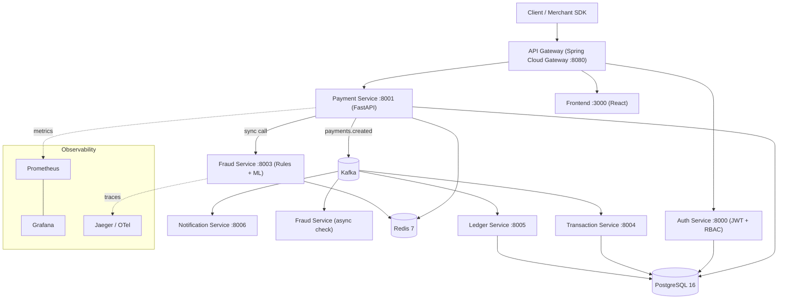

# Architecture Overview

## System Diagram

## Service Responsibilities

| Service | Responsibility | Sync dependencies | Async dependencies |
|---|---|---|---|
| `api-gateway` | Routing, JWT validation, rate limiting, circuit breaking | auth-service, payment-service | — |
| `auth-service` | User accounts, JWT issuance, RBAC | PostgreSQL | — |
| `payment-service` | Payment lifecycle, idempotency, refunds | fraud-service (sync check), PostgreSQL, Redis | Kafka producer (`payments.*`) |
| `fraud-service` | Rule-based + ML risk scoring | Redis (velocity counters) | Kafka consumer (`fraud.check`), producer (`fraud.alerts`) |
| `transaction-service` | Transaction lifecycle projection | PostgreSQL | Kafka consumer (`payments.completed`/`failed`) |
| `ledger-service` | Double-entry bookkeeping | PostgreSQL | Kafka consumer (`payments.completed`) |
| `notification-service` | Webhook/email delivery | — | Kafka consumer (`webhooks.dispatch`) |
| `frontend` | Merchant dashboard | api-gateway | — |

## Request Flow: Creating a Payment

1. Client calls `POST /payments` through the API Gateway with a JWT.
2. Gateway validates the token and routes to `payment-service`.
3. `payment-service` checks the idempotency key in Redis/Postgres, then makes
   a **synchronous** call to `fraud-service` for an inline risk decision.
4. Based on the fraud decision, the payment is marked `PENDING`/`PROCESSING`
   and persisted, then a `payments.created` event is published to Kafka.
5. `transaction-service`, `ledger-service`, and `notification-service` each
   consume the relevant downstream events independently and asynchronously.
6. `fraud-service` also runs a deeper **asynchronous** re-check from the
   `fraud.check` topic and can raise a `fraud.alerts` event after the fact.

## Design Principles

- **Idempotency first** — every state-changing endpoint accepts an
  idempotency key so retried requests are safe.
- **Sync for the decision that blocks the response, async for everything
  downstream** — fraud gets both: a fast synchronous check inline, and a
  deeper asynchronous re-check for cases the fast path can't fully resolve.
- **Service-owned data** — each service owns its own tables; cross-service
  reads go through APIs or events, not shared database access.
