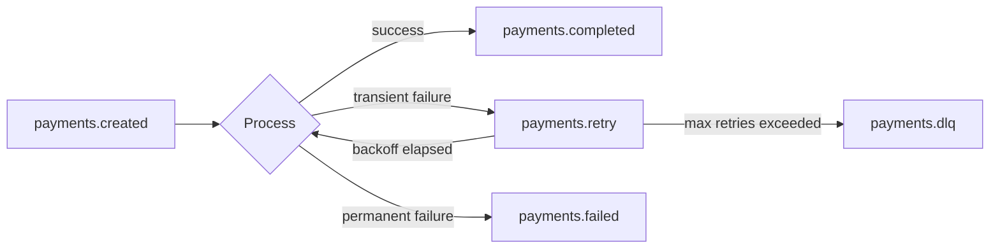

# Kafka Event Flows

## Topics (as declared in `docker-compose.yml` / README)

| Topic | Partitions | Producer | Consumer(s) | Purpose |
|---|---|---|---|---|
| `payments.created` | 6 | payment-service | transaction-service | New payment initiated |
| `payments.completed` | 6 | payment-service | transaction-service, ledger-service, notification-service | Payment succeeded |
| `payments.failed` | 3 | payment-service | transaction-service, notification-service | Payment failed |
| `payments.retry` | 3 | payment-service | payment-service (retry consumer) | Backoff retry queue |
| `payments.dlq` | 1 | payment-service (after max retries) | manual/ops tooling | Dead letter queue |
| `fraud.check` | 6 | payment-service | fraud-service | Async deeper fraud re-check |
| `fraud.alerts` | 3 | fraud-service | notification-service | High-risk fraud alert |
| `webhooks.dispatch` | 3 | notification-service (internal) | notification-service workers | Merchant webhook delivery |

## Known Inconsistency (found during audit)

Some producer code emits singular topic names (`payment.created`,
`payment.completed`, `payment.failed`) while the README/compose config and
other code paths use the plural form (`payments.created`, etc.). **Confirm
which is authoritative and standardize** — this is exactly the kind of
mismatch that causes silently-dropped messages (a producer publishing to a
topic no consumer is subscribed to) and is worth fixing before this project
is demoed live or load-tested.

## Retry & Dead-Letter Flow

## Consumer Group Notes

- Each downstream service should run its own consumer group so that
  `transaction-service`, `ledger-service`, and `notification-service` each
  get an independent copy of `payments.completed` rather than competing for
  partitions.
- Partition counts (6 for high-volume topics, 3 for lower-volume, 1 for DLQ)
  cap the maximum consumer parallelism per group — scale partitions before
  scaling consumer replicas beyond that count.

## Follow-ups (from the roadmap)

- Schema Registry (Avro/Protobuf) to enforce event contracts across services
  written in two different languages (Java gateway, Python services).
- Event versioning so consumers can tell an old-shape `payments.completed`
  event from a new one during rollout.
- Idempotent producers / exactly-once semantics if downstream ledger
  accuracy requires it.
